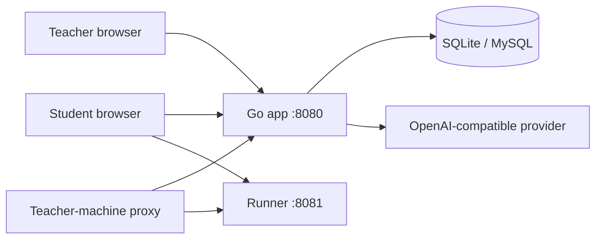

# Class Code Lab

<p align="center">
  <strong>An AI-assisted coding classroom platform for controlled local networks</strong>
</p>

<p align="center">
  <a href="https://github.com/Cute-chen/class-code-lab/actions/workflows/ci.yml"></a>
  <a href="LICENSE"></a>
  
  
</p>

<p align="center"><a href="README.md">简体中文</a> · <a href="README.en.md">English</a></p>


The demo uses fictional accounts and an isolated local database. It shows the full loop: describe an idea, receive an AI code proposal, apply it to the editor, inspect the code, and run the star-button game.


Class Code Lab helps students turn ideas into small HTML/CSS/JavaScript games and interactive pages. Students can discuss ideas with an AI assistant, edit and preview code in an isolated Runner, publish work to a class gallery, and review classmates' work. Teachers manage classes, rosters, AI providers, publishing permissions, scores, and audit logs.

> The project is designed for controlled local-network deployment. It is not a public-internet deployment recipe. The first teacher account is `teacher / 123456` and must change its password on first login.

## Use cases

- Classroom programming and information technology lessons
- Coding clubs and short creative programming workshops
- Local-network showcases and class competitions
- Teacher-led demonstrations where student devices can only reach a teacher machine

## Features

- AI-assisted idea exploration, full HTML proposals, incremental patches, and debugging
- CodeMirror editor with autosave, revisions, restore, preview, and publishing
- Separate Runner with sandboxed iframe, CSP, short-lived run tokens, and static checks
- Teacher dashboard for classes, Excel roster import, AI quotas, works, scores, and audit logs
- SQLite by default, with optional MySQL support
- OpenAI Chat Completions-compatible providers with SSE and JSON response support

## Architecture



## Quick start

Requirements: Go 1.26+, Node.js 20+, npm. MySQL 8+ is optional.

```bash
git clone https://github.com/Cute-chen/class-code-lab.git
cd class-code-lab

cd frontend
npm ci
npm run build

cd ../backend
cp .env.example .env
go run ./cmd/class-code-lab
```

Open `http://127.0.0.1:8080`. Runner uses port `8081` by default. If you change the app port, set Runner to the next port as well:

```bash
APP_ADDRESS=:18080 RUNNER_ADDRESS=:18081 go run ./cmd/class-code-lab
```

See the Chinese README for the full configuration table, portable builds, classroom workflow, privacy notes, and troubleshooting.

## Demo data

```bash
cd backend
go run ./cmd/seed-demo
```

This creates fictional demo classes and accounts in the configured database. All demo accounts start with `123456` and must change their password on first login.

## Security and privacy

The project is intended for a controlled LAN. The database stores student names, login names, work code, revisions, AI conversations, usage records, audit logs, and configured provider API keys. API keys are not returned by read APIs but are stored directly in the database. Do not expose the service to the public Internet without adding appropriate access control, HTTPS, isolation, and a security review.

## Keywords

AI programming classroom, local-network teaching, creative coding, student work gallery, teacher dashboard, HTML/CSS/JavaScript, SQLite, MySQL, and OpenAI-compatible API.

## Documentation and license

- [Chinese README](README.md)
- [Development and acceptance notes](docs/开发与验收记录.md)
- [Third-party notices](THIRD_PARTY_NOTICES.md)
- [MIT License](LICENSE)
