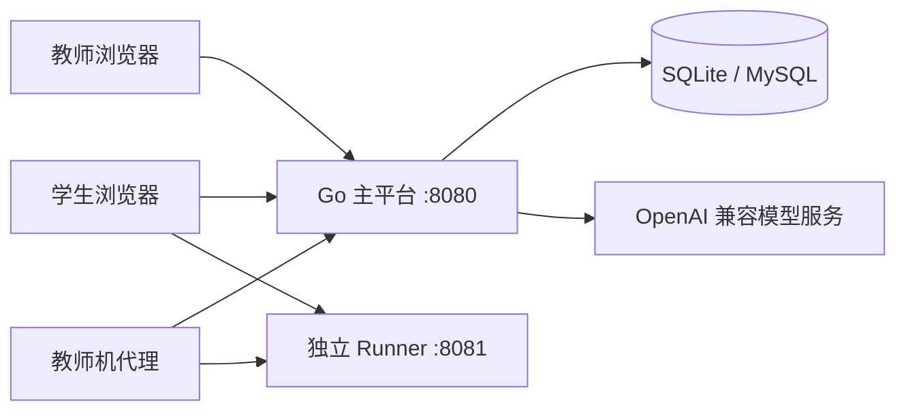
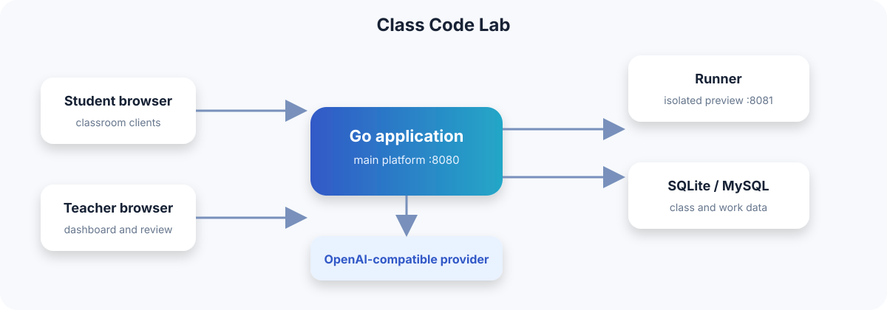

# 代码创作实验室 · Class Code Lab

<p align="center">
  <strong>面向受控局域网课堂的 AI 趣味编程平台</strong>
</p>

<p align="center">
  <a href="https://github.com/Cute-chen/class-code-lab/actions/workflows/ci.yml"></a>
  <a href="LICENSE"></a>
  
  
  
</p>

<p align="center">
  <a href="README.md">简体中文</a> · <a href="README.en.md">English</a>
</p>


上面的演示使用虚构账号和本地隔离数据库，完整展示了：描述想法 → AI 返回代码提案 → 应用到编辑器 → 查看代码 → 运行星光按钮小游戏。


学生可以和 AI 讨论创意、编辑和运行单文件网页作品，再发布到班级广场；教师负责班级、名单、AI 服务、作品审核和课堂积分。项目默认使用 SQLite，支持 MySQL，并将学生作品放在独立 Runner 中预览。

> 项目按受控局域网自部署设计，默认不面向公网。首次教师账号为 `teacher / 123456`，首次登录后必须改密。

## 使用场景

| 场景 | 适合做什么 |
| --- | --- |
| 信息科技课堂 | 学生从创意出发，完成小游戏、互动页面和小应用 |
| 编程社团 | 让学生在一节课内完成“想法—代码—预览—发布”闭环 |
| 校园创意活动 | 用班级广场集中展示作品，并通过积分形成排行榜 |
| 局域网演示 | 教师机代理让受限网络中的学生访问内网主服务和 Runner |

## 功能一览

### 学生端

- AI 创作助手：讨论想法、生成完整 HTML、提出增量修改和修复建议
- CodeMirror 编辑器：自动保存、历史版本、恢复和清空重建
- 独立 Runner：运行预览、错误反馈、发布时自动截取首帧封面
- 班级广场：体验同学作品、评分、查看排行榜和跨班精选

### 教师端

- 班级、学生和 Excel 名单管理
- 登录、AI、发布和修改权限控制
- 多组 OpenAI Chat Completions 兼容服务的并发和用量管理
- 作品预览、审核、撤下、锁定、精选和积分管理
- 课堂总览、学生状态、AI 对话和审计日志

### 运行边界

- 主平台和 Runner 分端口运行
- 学生代码使用 `sandbox="allow-scripts"` iframe、CSP、权限策略和短期运行令牌
- 服务端静态检查会拦截网络请求、表单、外部跳转、弹窗、嵌套网页、Worker、动态字符串执行和明显无限循环
- 外部脚本和样式只允许带版本号的 jsDelivr 与 cdnjs 地址

浏览器沙箱和静态检查不能对任意 JavaScript 提供数学意义上的安全保证。本项目适合受控局域网；公网部署需要额外隔离、HTTPS、访问控制和安全评估。

## 系统结构





技术栈：React、Vite、CodeMirror 6、Phosphor Icons、Go、Gin、GORM、SQLite、MySQL。

## 快速开始

### 环境要求

- Go 1.26+
- Node.js 20+
- npm
- 使用 MySQL 时需要 MySQL 8+

### 本地启动

```bash
git clone https://github.com/Cute-chen/class-code-lab.git
cd class-code-lab

cd frontend
npm ci
npm run build

cd ../backend
cp .env.example .env
go run ./cmd/class-code-lab
```

打开 `http://127.0.0.1:8080`。局域网内其他设备使用服务器 IP 和 `8080` 访问；Runner 默认使用同一主机的 `8081`，两个端口都需要在防火墙中放行。

如果要换端口，两个端口必须保持相邻：

```bash
APP_ADDRESS=:18080 RUNNER_ADDRESS=:18081 go run ./cmd/class-code-lab
```

### 本地前端开发

后端启动后，在另一个终端运行：

```bash
cd frontend
npm run dev
```

Vite 开发服务器默认使用 `5173`，并将 `/api` 转发到 `127.0.0.1:8080`。要验证 Runner 和完整发布流程，请使用生产构建后从后端端口访问。

### 配置项

将 `backend/.env.example` 复制为 `backend/.env`。系统环境变量优先于 `.env`。`ADMIN_*` 只在数据库首次初始化、创建教师账号时生效。

| 配置项 | 默认值 | 说明 |
| --- | --- | --- |
| `DATABASE_DSN` | `sqlite://./class-code-lab.db` | SQLite 文件路径，也可使用 MySQL DSN |
| `APP_ADDRESS` | `:8080` | 主平台监听地址和端口 |
| `RUNNER_ADDRESS` | `:8081` | Runner 监听端口，应为主平台端口加一 |
| `FRONTEND_DIST` | 空 | 空值使用内嵌前端；开发时可设为 `../frontend/dist` |
| `COOKIE_SECURE` | `false` | HTTPS 部署时设为 `true` |
| `SESSION_HOURS` | `10` | 登录会话有效期，单位小时 |
| `RUN_TOKEN_MINUTES` | `5` | 作品运行链接有效期，单位分钟 |
| `ADMIN_NAME` | `任课教师` | 首次教师账号显示名 |
| `ADMIN_LOGIN` | `teacher` | 首次教师账号登录名 |
| `ADMIN_PASSWORD` | `123456` | 局域网首次部署的初始密码，首次登录强制改密 |

模型服务由教师在后台配置。旧版 `AI_*` 环境变量只在升级已有数据库时导入一次。

## 演示数据

使用独立的 SQLite 数据库快速查看教师端和学生端：

```bash
cd backend
go run ./cmd/seed-demo
```

命令会重新生成 `演示班 A`、`演示班 B` 和虚构账号，不会删除其他正式班级。所有演示账号初始密码均为 `123456`，首次登录必须改密；重复执行会重建这两个演示班的数据。

## Windows 便携版与教师机代理

主平台便携包：

```bash
./build-portable.sh
```

输出：`dist/class-code-lab-portable-windows-x64.zip`。解压后双击 `start.bat`，默认监听 `8080/8081`。

教师机代理包：

```bash
./teacher-proxy/build-portable.sh
```

输出：`dist/teacher-proxy-portable-windows-x64.zip`，默认监听 `8088/8089`。启动向导中的上游目标必须改为实际主服务地址；如果主服务不在教师机上，不能使用默认的 `127.0.0.1`。

## 数据与隐私

- SQLite 数据库保存学生姓名、登录名、作品代码与历史版本、AI 对话与用量、审计记录以及模型服务 API Key。
- API Key 不通过读取接口返回，但在数据库中直接保存；数据库和备份文件必须限制访问权限。
- 学生与 AI 的对话和代码会发送给教师配置的模型服务。使用真实学生数据前，应按所在机构要求告知使用范围。
- 开放登录的班级会通过无需登录的名单接口返回姓名和登录名，因此不要把服务直接暴露到公网。
- 代理默认不限制来源 IP；多网段环境可通过 `-allow` 指定允许访问的客户端网段。

## 常见问题

- **页面可以打开但预览失败：**检查 Runner 是否监听“主平台端口 +1”、防火墙是否放行，并访问 `http://<服务器地址>:<Runner端口>/health`。
- **代理登录正常但预览失败：**检查代理和后端的两个端口，以及代理的上游目标地址。
- **AI 不可用：**确认教师后台已配置并启用模型服务，使用“测试连接”检查地址、模型名和 API Key。未配置模型时仍可手动创作和发布。
- **修改端口后预览失败：**同时修改 `APP_ADDRESS` 和 `RUNNER_ADDRESS`，保持 Runner 端口为主平台端口加一。

## 开发与验证

```bash
cd backend
go test ./...
go build ./...

cd ../teacher-proxy
go test ./...
go build ./...

cd ../frontend
npm ci
npm run build
```

健康检查：

```bash
curl http://127.0.0.1:8080/api/health
curl http://127.0.0.1:8081/health
```

## 文档与许可证

- [开发与验收记录](docs/开发与验收记录.md)
- [教师端与学生端设计](docs/教师端与学生端设计.md)
- [系统实施计划](docs/系统实施计划.md)
- [开源清理与发布计划](docs/开源清理与发布计划.md)
- [第三方许可证声明](THIRD_PARTY_NOTICES.md)
- [MIT License](LICENSE)

## 当前范围

项目已完成基础工程验证，但还没有包含校园服务器部署、域名、HTTPS、真实模型付费测试和 60 人真实并发压测。正式课堂使用前，请用两个测试班进行一次局域网演练。
